# Project 7 - Bash Scripting and VM Automation

- [Project 7 - Bash Scripting and VM Automation](#project-7---bash-scripting-and-vm-automation)
  - [Introduction](#introduction)
  - [Automation Workflow](#automation-workflow)
  - [Methodology](#methodology)
  - [Setting Up Instances (Stage 1)](#setting-up-instances-stage-1)
  - [Creating the Scripts (Stage 2)](#creating-the-scripts-stage-2)
    - [App Bash Script - Fresh Install (prov-app.sh)](#app-bash-script---fresh-install-prov-appsh)
    - [Database Bash Script - Fresh Install (prov-db.sh)](#database-bash-script---fresh-install-prov-dbsh)
    - [Run App Only Script - Fresh Install (run-app-only.sh)](#run-app-only-script---fresh-install-run-app-onlysh)
  - [Image Creation (Stage 3)](#image-creation-stage-3)
  - [Methods of Testing](#methods-of-testing)
    - [Testing Idempotency of App script on post-setup:](#testing-idempotency-of-app-script-on-post-setup)
    - [Testing Idempotency of DB script on post-setup:](#testing-idempotency-of-db-script-on-post-setup)
    - [Displayed Outcome (Screenshots):](#displayed-outcome-screenshots)
  - [Task Management](#task-management)
  - [Blockers](#blockers)
  - [Benefits and Learning Outcomes](#benefits-and-learning-outcomes)
  - [Conclusion](#conclusion)

## Introduction

The objective of this project was to create a series of bash scripts that would automate the deployment of a web application and database on AWS. The scripts needed to be idempotent, meaning they could run multiple times without causing issues, and work both as direct execution scripts and as user data for VM initialization.

This solves the problem of having to manually deploy the app and database on AWS. This is a time consuming task that can be automated with a script.

## Automation Workflow

**TODO:** Leaving this space for a diagram of the process.

My automation process followed these stages:
1. Manual Deployment (Initial Testing)
2. Bash Script Development ([prov-app.sh](prov-app.sh) & [prov-db.sh](prov-db.sh))
3. User Data Implementation
4. Image Creation
5. Streamlined Deployment (run-app-only.sh)

## Methodology

I approached this project in three distinct stages:

* Stage 1 - Script Development:
  - Created [prov-db.sh](prov-db.sh) for database provisioning
  - Developed [prov-app.sh](prov-app.sh) for application deployment
  - Tested each script independently
  - Ensured idempotency through multiple test runs

* Stage 2 - User Data Integration:
  - Modified scripts to work as user data
  - Adjusted file paths for root execution
  - Added detailed logging for troubleshooting
  - Implemented error handling

* Stage 3 - Image Creation:
  - Created base images from successfully deployed instances
  - Developed run-app-only.sh for quick deployment
  - Tested image-based deployment process
  - Documented recovery procedures

## Setting Up Instances (Stage 1)
I utilized AWS infrastructure with the following configuration:

*Settings for App Instance:*
- `Name`: **ameenah-sparta-app-vm**
- `Instance Type`: t2.micro
- `Security Groups`: Allow SSH, HTTP, and HTTPS
- `VPC`: Default VPC
- `Subnet`: Default subnet
- `Network`: Public subnet for internet access

*Settings for DB Instance:*
- `Name:` **ameenah-sparta-db-vm**
- `Instance Type`: t2.micro
- `Security Groups`: Allow SSH and port 27017 from App Instance
- `VPC`: Default VPC
- `Subnet`: Default subnet
- `Network`: Private subnet for database security

*Network Configuration:*
- Default VPC used for both instances
- App instance in public subnet for internet access
- DB instance in private subnet for security
- Security groups configured for minimal required access

I utilized Terraform to create these VMs to save time when debugging on a multiple of occasions.

## Creating the Scripts (Stage 2)

### App Bash Script - Fresh Install (prov-app.sh) 

I created a bash script with conditions that checks the success and failure of the app deployment script. The actions are displayed with an echo statement in green to differentiate from the rest of the output.

[prov-app.sh](prov-app.sh)

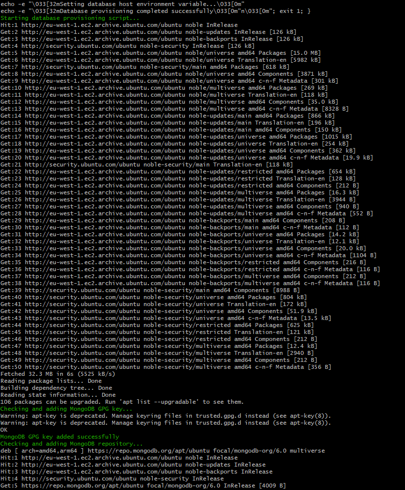
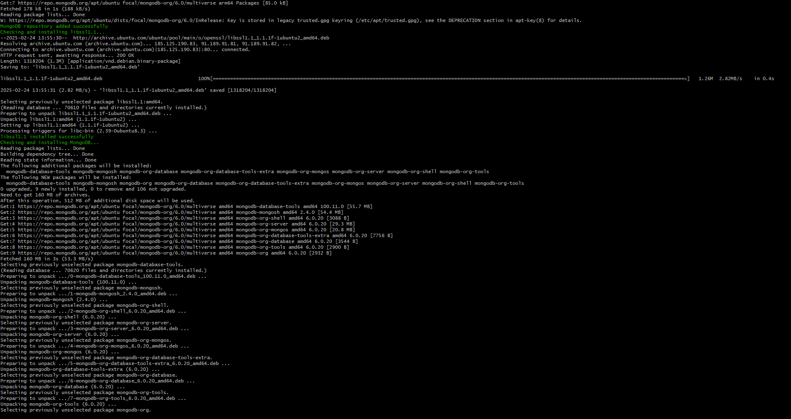
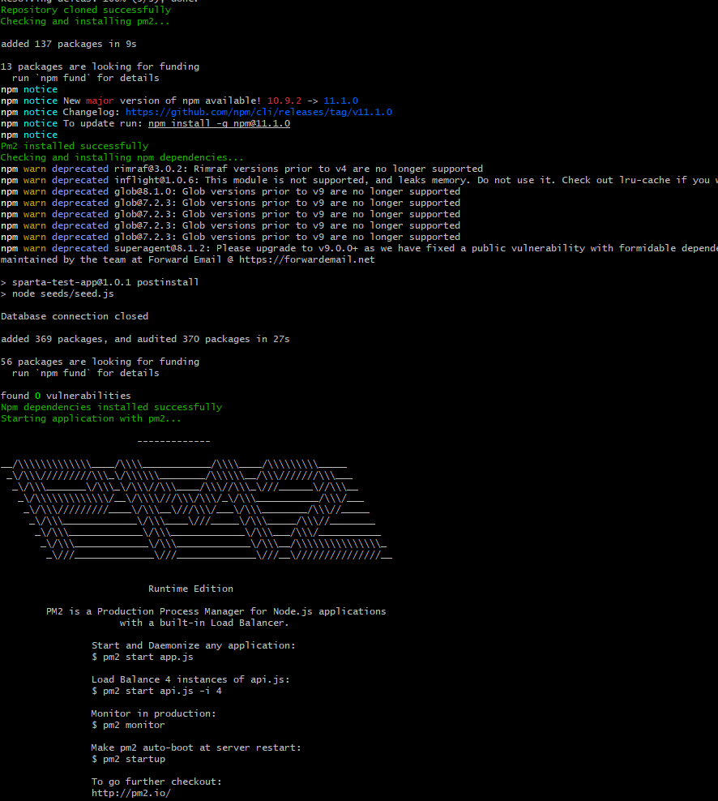


### Database Bash Script - Fresh Install (prov-db.sh)

Similarly, one was created for the database provisioning script.
[prov-db.sh](prov-db.sh)

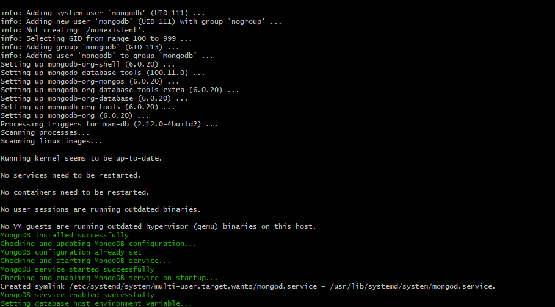


### Run App Only Script - Fresh Install (run-app-only.sh)


[run-app-only.sh](run-app-only.sh)

## Image Creation (Stage 3)

I created two images from the successful instances. The first image was created from the app instance, and the second from the database instance.

I researched and found that waagent was not needed for AWS. I'll use my app VM as an example here:

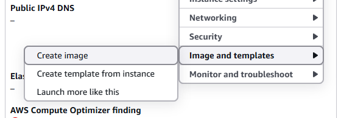

All I needed was to make my new VMs using the images I exported, and to use the run-app-only.sh script to deploy the app from the image.

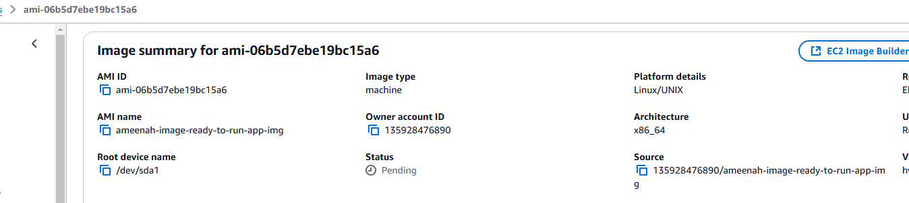

This was a successful deployment. A secondary set of VMs were created from the images and the app was deployed from the image. Both VMs were successfully deployed, and the post page worked as expected.

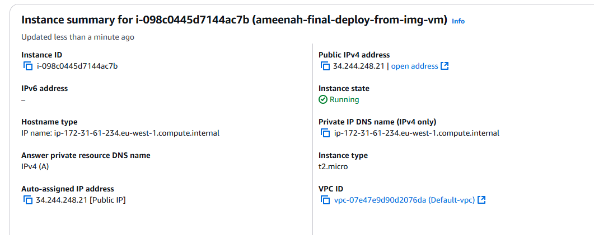
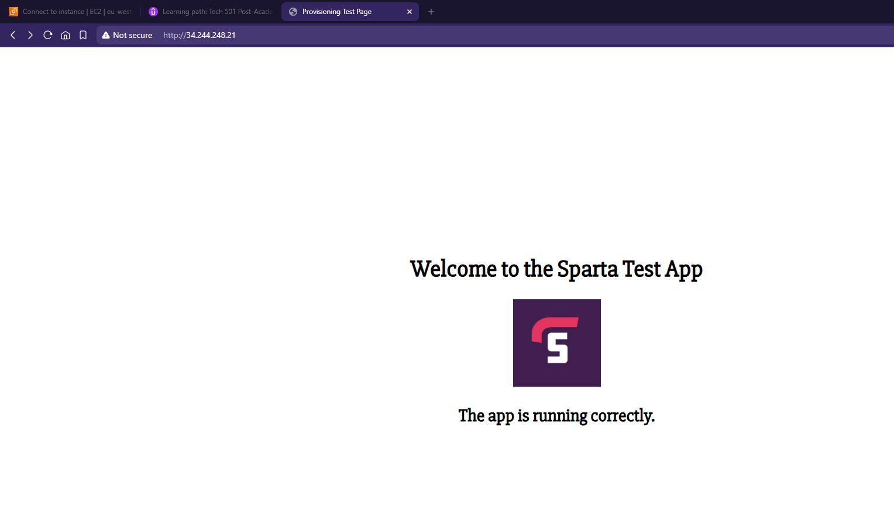
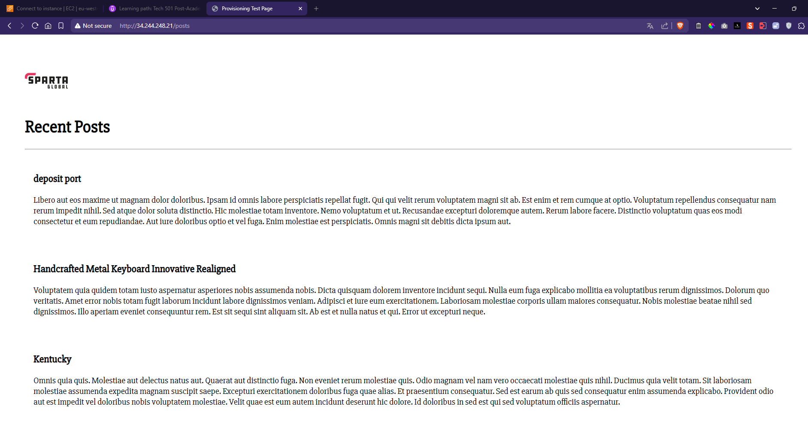

## Methods of Testing 

I implemented a comprehensive testing strategy:

1. Clean Installation Testing
   - Deployed on fresh instances
   - Verified all dependencies
   - Developed and tested scripts

2. Idempotency Testing
   - Multiple script executions
   - Verified no duplicate services
   - Checked for error handling

3. Image Testing
   - Deployed from images
   - Verified app functionality
   - Checked service status
   - Tested user data

As I wanted to keep an incremental approach, I used Terraform to run the bash scripts on the app and database instances. I created a Terraform script that runs the bash scripts on the instances, this method was useful as it allowed me to test the scripts on the instances and see the results as I went along - correcting any errors as I went.

After each phase was done, I would go back and check to see if the script did what I wanted it to do, a good example of this was checking if the bindip was updating in it's file - this was something that could easily be missed if I was not taking a step back and checking the output.

I backed up my scripts ran them again on clean instances to ensure that the script was idempotent, and again on that VM to see what happened.

I also used them on my VMs that were deployed from the images to see if they worked.

### Testing Idempotency of App script on post-setup:
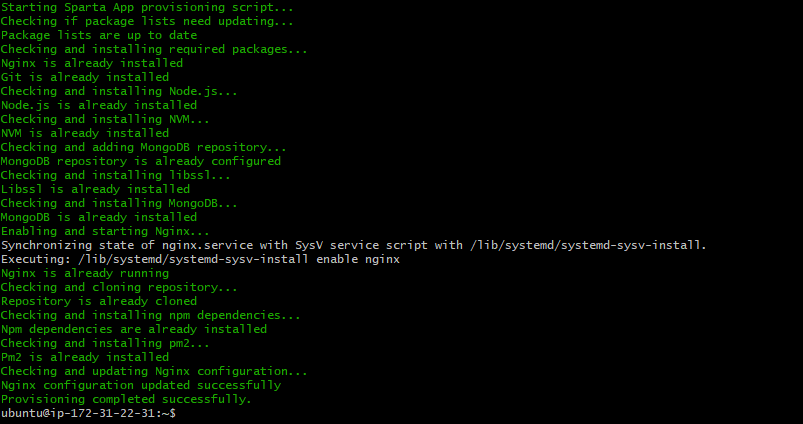

### Testing Idempotency of DB script on post-setup:
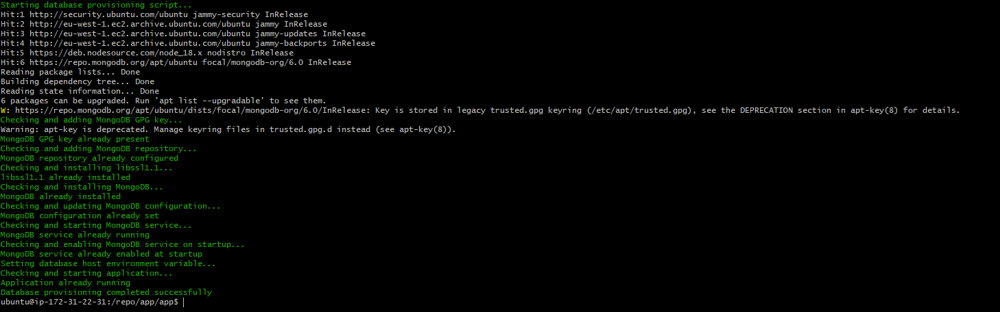

### Displayed Outcome (Screenshots):
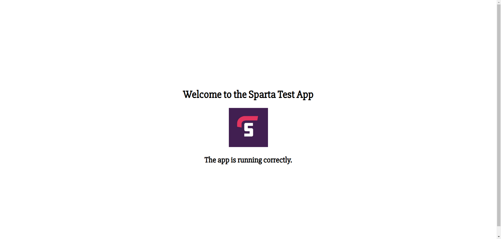
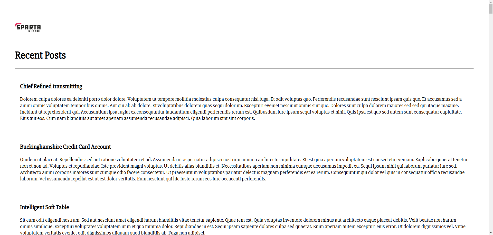

## Task Management 

As part of the project requirements, a task management project was created on the repo to track changes made to the project.

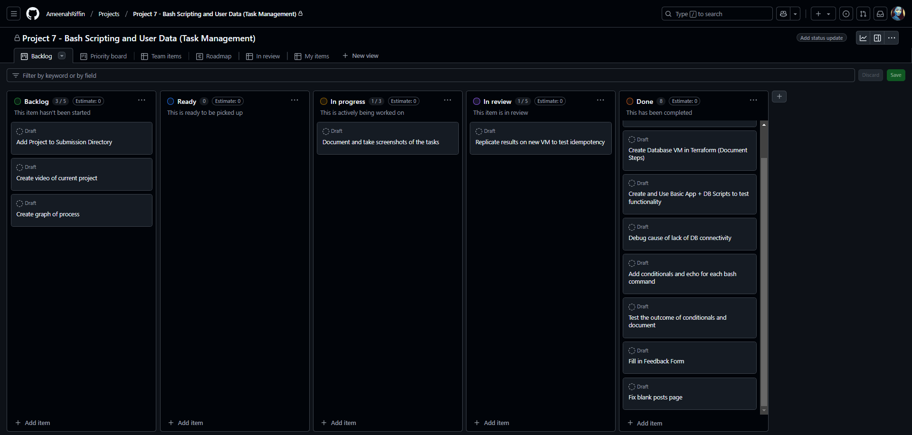


## Blockers

During my task, I encountered blockers and learned a few things that were very helpful in my learning journey.

1. **Understanding root spawned processes:**
    
    While debugging the App VM bash script run from user dataa, I was not able to find the app files nor the PM2 instance. This stopped me from doing an app restart as I intended. I looked into this and realized that if these are installed by root, they will not be visible to the user account I'm using (ubuntu). 

    *I found this solution:*

    - Find All Node-Related Services
    - List all services and look for anything related to Node.js or app.js:

    ```bash
    systemctl list-units --type=service | grep -i node
    systemctl list-units --type=service | grep -i app
    ```
    Inspect the /etc/.pm2 instance: Since it's running as root, check its process list:

    ```bash
    sudo PM2_HOME=/etc/.pm2 pm2 list
    ```
    If the app is listed, stop and start it:

    ```bash
    sudo PM2_HOME=/etc/.pm2 pm2 stop app
    sudo PM2_HOME=/etc/.pm2 pm2 start app
    ```

    Or alternatively, delete it:
    ```bash
    sudo PM2_HOME=/etc/.pm2 pm2 delete app
    ```

    Additionally, DB_HOSTS needs to be set on root, as well. Unless you make it global.

    Root can be accessed with:
    ```sudo su```

    I believe this information should be able help me in future deployments.


2. **Database connection issues:**
   
    I encountered issues with the database connection, which was causing the app to fail. I spent a lot of time trying to fix this, but I was unable to resolve it. Remaking the VMs and subnets was one of the things I tried, which seemed not to work at the time but seemed to resolve it later.

    I tried to debug by pinging the database from the app instance, but it was not working. The app and database were on the same subnet, so I thought that the issue was with the security group - however they were configured correctly. IE: TCP 3000, 22, and 80 were open for the app. Database was open for MongoDB's outbound port 27017 and inbound SSH (which I was able to access).

    I looked further into this and found that the issue was with bindip not being  set correctly in my userdata's sed command, along with needing to restart the app. There may have been other causes for my trouble, but I did not have enough time to do a full investigation.

    I plan to do a more thorough investigation into that and document my findings.


## Benefits and Learning Outcomes

Throughout this project, I developed my skills in bash scripting while creating deployment scripts.

The challenges I encountered, particularly with user permissions and database connectivity gave me a better insight on maintaining and debugging production environments.

## Conclusion

I like this project. I learned a lot about keeping a consistent process with incremental approaches to building a bash script deploy a web application and database on AWS. 

The scripts and images created provide a reliable, repeatable deployment process that significantly reduces manual intervention and potential human error. 


